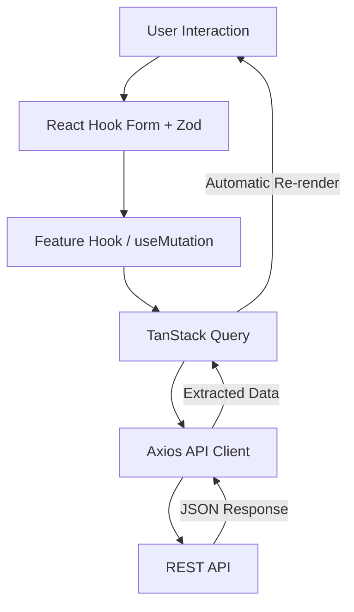
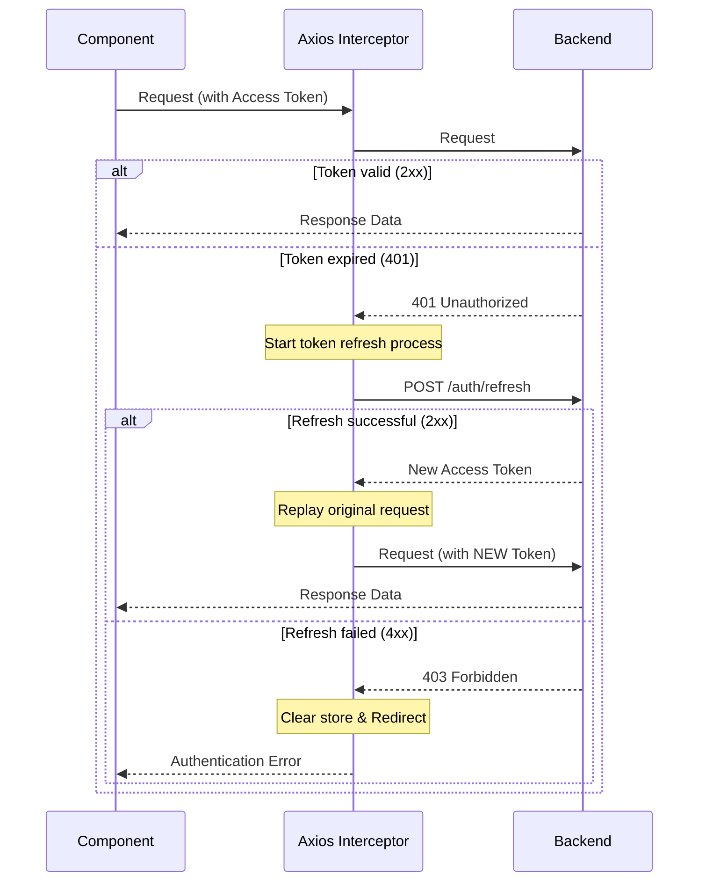

# Jolie Brasserie Café — Frontend

A production-grade React application for a full-stack restaurant platform.  
This client serves both **customers** (ordering, reservations) and **admins** (operations management) with a unified, high-performance UI.

---

## ✨ Overview

- Built with **React 19 + TypeScript**
- Powered by **TanStack Query** for server-state management
- Uses **Zustand** for lightweight client state
- Fully integrated with a **JWT-based backend API**
- Designed with a **feature-based architecture** for scalability

---

## 🚀 Core Features

### Customer Experience

- Menu browsing with **search, filters, sorting**
  - URL-synced filters & pagination (shareable state)
  - Clean URLs (default values omitted)
- Advanced **cart system**:
  - Dish extras (ingredients)
  - Standalone ingredient ordering
  - Notes & quantity control
- **Checkout flow**:
  - Order types: Dine-in / Takeout / Delivery
  - Live pricing preview (tax, delivery, service fee)
  - Payment methods (Card, BLIK, Cash)
- **Reservations**:
  - Business-hours-aware date picker
  - Guest count & pre-orders
- **Profile management**:
  - Addresses
  - Payment methods
  - Credentials

### Admin Panel

- **Dashboard with KPIs**
- Orders management (status transitions, breakdown)
- Reservations CRUD with conflict handling
- Menu & ingredient management
- User management (roles, safe delete)
- Dynamic pricing configuration (tax, delivery fee, etc.)
- **Menu & ingredient management**:
- Image upload via Cloudinary (optimized delivery, CDN)

---

## 🧱 Architecture

### Feature-Based Structure

```text
src/
├── app/      # Providers, router, global setup
├── features/ # Customer domains (cart, menu, orders)
├── admin/    # Admin domains
├── pages/    # Route-level pages
└── shared/   # API, UI, hooks, types
```

Each feature follows a consistent module pattern:

```text
feature/
├── components/
├── hooks/
├── pages/
├── schemas/ # Zod validation
├── mappers/ # Form ↔ DTO transformation
├── dto/     # Data Transfer Objects
└── types.ts # Local types
```

---

## 🔄 Data Flow



---

## 🔐 Authentication Flow



- **✔ Robust Interceptors**: Implemented via Axios interceptors with request queueing.
- **✔ Atomic Refresh**: Prevents race conditions on concurrent 401 responses.
- **✔ OAuth Support**: Social login integration (e.g. Google) alongside JWT authentication
- **✔ Hybrid Auth Flow**: Supports both credential-based and OAuth-based authentication

---

## 🧠 State Management

### Zustand (Client State)

Used for lightweight, global UI or session state:

- **Auth state** (user, tokens, isAuthenticated)
- **UI state** (modals, drawer states, temporary filters)

### TanStack Query (Server State)

Handles all asynchronous data fetching and synchronization:

- **Domains**: Cart, Orders, Menu, Reservations, Admin analytics.
- **Key characteristics**: Structured query keys, targeted cache invalidation, custom stale-time tuning, and optimistic updates for critical feedback.

---

## 🔗 URL State Management

The application uses URL query parameters as a source of truth for filters and pagination.

### Key Principles

- **Single Source of Truth**: Filters and pagination are derived from the URL
- **Clean URLs**: Default values (e.g. `page=1`) are omitted
- **Shareability**: State can be shared via link
- **Resilience**: Invalid values are safely parsed and normalized

### Example

Frontend URL: /admin/orders?status=PREPARING

API Request: /orders/admin/all?page=1&limit=7&status=PREPARING

Default values are applied internally while keeping the URL minimal.

---

## 💰 Pricing Strategy

The client implements a `calcFinalTotalClient` utility that mirrors the backend's pricing logic.

- **Why**: Provides instant UX feedback without waiting for a server round-trip.
- **Guarantee**: The backend remains the **single source of truth**; it recalculates and enforces all totals upon submission.

---

## ⚙️ Key Engineering Decisions

1.  **TanStack Query over Redux**: Server state is inherently cacheable and synchronized; Query handles this out-of-the-box better than a manual Redux store.
2.  **Zustand for minimal state**: Avoids React Context re-renders and provides a simpler, faster API than Redux for client-only state.
3.  **Zod for Forms**: Bridges the gap between runtime validation and TypeScript type inference.
4.  **Feature Module Pattern**: Localizes complexity and ensures the codebase scales linearly as new business domains are added.
5.  **Axios Interceptor (Refresh-on-401)**: A critical piece that transparently handles token rotation and replays failed requests.
6.  **Cloudinary for Media**: Offloads image storage and optimization to a dedicated CDN-backed service.
7.  **Hybrid Authentication (JWT + OAuth)**: Supports flexible authentication strategies while maintaining a unified session model.

---

## 🎨 UI & Styling

- **Tailwind CSS v4**: Modern utility-first styling with native CSS variable support.
- **Radix UI**: Unstyled, accessible primitives used for complex components (Modals, Selects, Tabs).
- **Sonner**: High-performance toast notifications.

---

## 📦 Tech Stack

| Layer        | Technology            |
| ------------ | --------------------- |
| Framework    | React 19              |
| Language     | TypeScript            |
| Build Tool   | Vite                  |
| Routing      | React Router v7       |
| Data Loading | TanStack Query v5     |
| State        | Zustand               |
| Forms        | React Hook Form + Zod |
| UI           | Radix UI              |
| Styling      | Tailwind CSS v4       |
| HTTP         | Axios                 |
| Media        | Cloudinary            |
| Auth         | JWT + OAuth           |

---

## 🛠 Setup

### Prerequisites

- Node.js 20+

### Installation

```bash
npm install
```

### Environment

Copy `.env.example` to `.env`:

```bash
cp .env.example .env
```

_Required variable:_ `VITE_API_URL` (pointing to your running backend).

---

## ▶️ Running the App

### Development

```bash
npm run dev
```

### Build & Production Preview

```bash
npm run build
npm run preview
```

---

## ⚠️ Known Limitations

- **No real-time updates**: Significant status changes currently require manual refresh or polling.
- **Shared Schemas**: Zod schemas are currently duplicated between frontend and backend.
- **Pricing Logic**: Manually mirrored from backend to frontend (intentional duplication for UX).

---

## 🛣 Roadmap

- [ ] i18n (Multi-language support)
- [ ] Theme System (Dark/Light mode auto-switching)
- [ ] WebSocket/SSE for live order tracking
- [ ] Shared schema package (Monorepo transition)

---

## 📄 License

MIT
